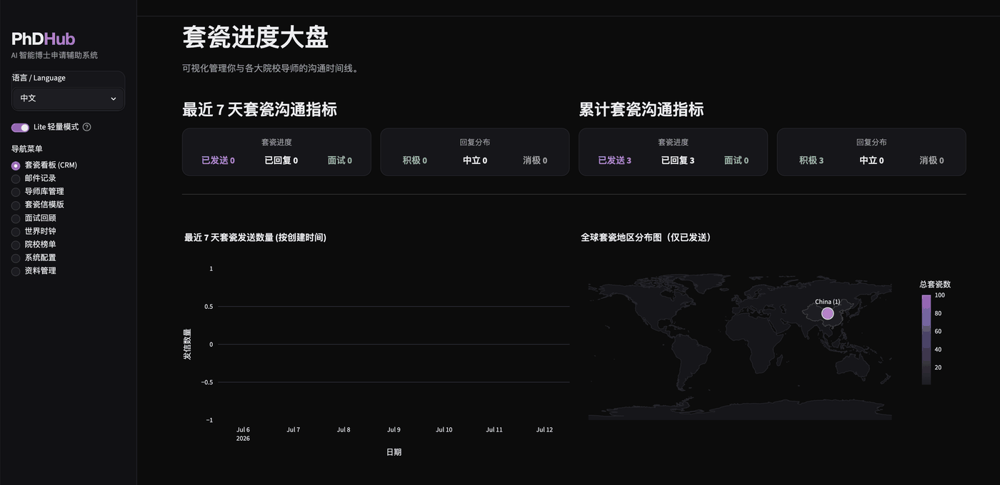

# PhDHub

[English](README.md) | [中文](README_CN.md)

PhDHub is a localized AI workspace for PhD applicants. It connects resume/RP management, email triage, professor tracking, interview preparation, and interview review into one workflow, so you can reduce context switching and follow-up misses.

## 🔥 New Release: Lite Mode

The new version of PhDHub introduces Lite Mode for users who do not want to configure email authorization, API keys, or AI features right away. Lite Mode keeps the core outreach workflow: Outreach Dashboard, Email Records (Lite), and Professor Database, so you can start organizing professors, logging emails, and tracking reply status with a much lighter setup.

Key differences between Lite Mode and Full Mode:

- Lite Mode does not require IMAP email authorization or AI model access. Full Mode includes smart email fetching, AI email classification, resume/RP analysis, interview preparation, and other automated workflows.
- Lite Mode uses manually entered email records for outreach tracking. You can tag emails as sent inquiry, positive reply, neutral reply, negative reply, interview scheduled, or non-outreach, and those tags update the professor database and dashboard.
- Lite Mode and Full Mode share the same local data, including the professor database and email cache. You can start with manual tracking in Lite Mode, then switch to Full Mode later for AI and email automation.

## UI Preview (Carousel)



## Features

- Resume Management (My Resume)
  - Upload, switch, delete, and preview multiple PDF resumes.
  - AI-generated resume analysis (strengths, weaknesses, improvements) with per-resume caching.

- RP Management (My RP)
  - Upload, switch, delete, and preview multiple RP PDFs.
  - AI-generated RP analysis (good points, weaknesses, improvements).

- Smart Email Center (AI Email)
  - IMAP email fetching, cache loading, and manual force refresh.
  - Automatic classification of PhD-related emails (sent inquiry, positive/neutral/negative reply, interview, etc.).
  - Extract professor profile fields from email + homepage content and sync to the professor database.

- Outreach Dashboard
  - Shows 7-day and all-time metrics (sent, replies, positive/neutral/negative, interview scheduled).
  - Stage-based progress tracking and visualization.

- Professor Database (Professor DB)
  - Unified management for professor/school/department/country/research direction/stage/timestamps.
  - Supports filtering, timezone display, and record maintenance.

- Interview Prep
  - One-click generation of high-frequency interview questions.
  - Personalized interview advice based on resume + professor homepage + paper signals.
  - Mock interview dialogue, follow-up questioning, scoring, and review.
  - High-frequency point bank (question + suggested answer + key points).

- System Config
  - Qwen/Gemini provider switching and auto-saved API keys.
  - Email connection setup (IMAP/SMTP).

## One-Click Conda Setup and Start

> Requires Miniconda or Anaconda. Just run one script: it creates/uses the `phdhub` conda environment, prepares missing packages when needed, and starts PhDHub with progress messages. If everything is already installed, it skips setup and starts directly.

1. Clone the repository

```bash
git clone <your-repo-url>
cd PhDHub
```

2. Run the one-click script

```bash
bash run.sh
```

When Streamlit finishes starting, open: http://localhost:8501

Useful options:

```bash
# Use a custom conda environment name
CONDA_ENV_NAME=phdhub-lite bash run.sh

# Use another port
APP_PORT=8502 bash run.sh
```

## Start with Docker Compose

If Docker / Docker Compose is installed, you can run PhDHub in a container:

```bash
docker compose up -d --build
```

Then open: http://localhost:8501

Useful commands:

```bash
# Follow logs
docker compose logs -f phdhub

# Stop the service while keeping the data volume
docker compose down

# Use another host port, for example 8502
PHDHUB_PORT=8502 docker compose up -d
```

Application data is persisted in the Docker volume `phdhub_data` (mounted at `/data` in the container). To remove persisted data, run `docker compose down -v`.

## Configuration

After first launch, open `系统配置 / System Config` and fill in:

- Email account, IMAP/SMTP, and app password (recommended)
- AI provider (Qwen or Gemini) and the corresponding API key

---

作者主页: https://d2simon.github.io/
研究方向：计算机视觉

作者也在申请博士中，如果你正在招收 26-27 届博士，期待我们建立联系。如果有任何你觉得实用的功能或者遇到什么 bug，可以在 issue 中提出。

Author Homepage: https://d2simon.github.io/
Research Direction: Computer Vision.

I am also applying for PhD programs. If you are recruiting PhD students for the 2026-2027 intake, I would be glad to connect with you. If you find any useful feature ideas or run into bugs, please open an issue.

希望大家都能拿到心仪的 PhD offer。
Wishing everyone the best in getting their ideal PhD offer.
