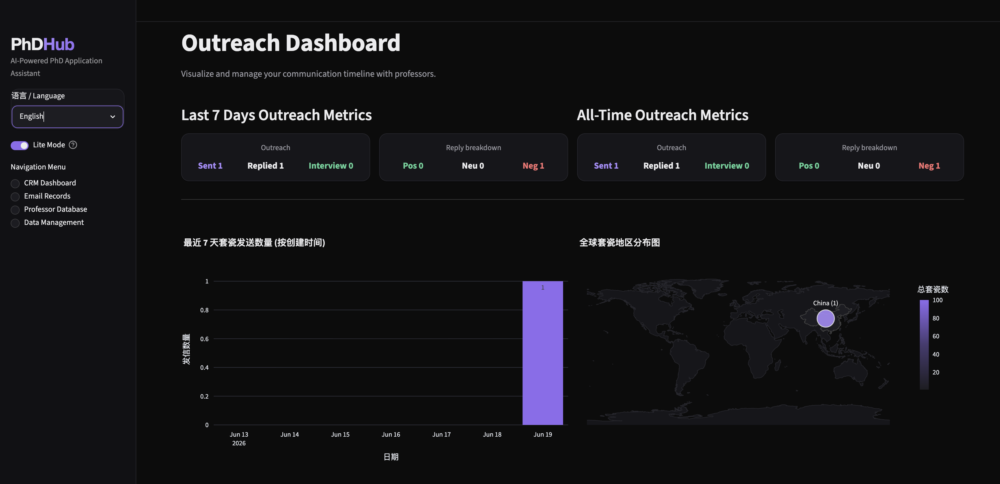
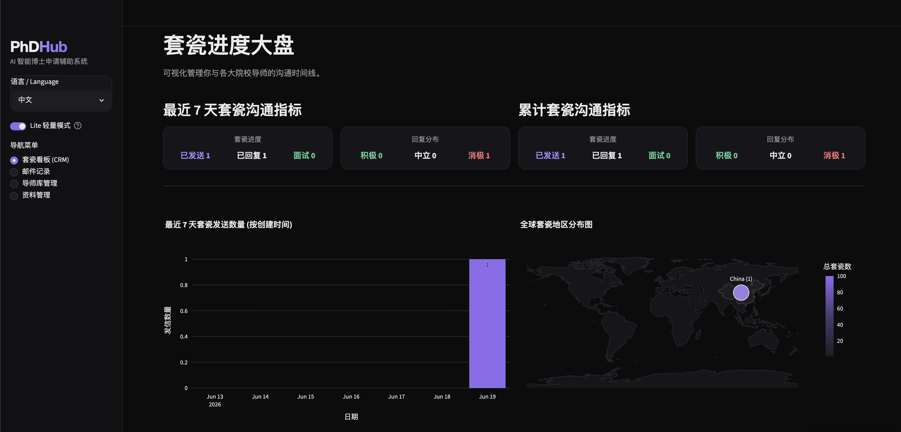

# PhDHub

[中文](README_CN.md) | [English](README.md)

PhDHub 是一个面向博士申请场景的本地化 AI 工作台，把“简历/RP 管理、邮件识别与分类、导师建库、面试准备与复盘”串成一个闭环，帮助申请者减少信息分散和跟进遗漏。

## 🔥 新版本更新：推出 Lite 轻量版

新版 PhDHub 新增 Lite 轻量版，适合暂时不想配置邮箱授权、API Key，或只需要手动记录套瓷进展的用户。Lite 版保留最核心的申请跟进流程：套瓷看板、邮件记录(Lite) 与导师库管理，让你可以用更低的配置成本开始整理导师、记录邮件、追踪回复状态。

Lite 版与完整版的主要区别：

- Lite 版不需要 IMAP 邮箱授权，也不依赖 AI 模型能力；完整版则提供智能邮箱拉取、AI 邮件分类、简历/RP 分析、面试准备等自动化功能。
- Lite 版通过手动录入邮件来管理套瓷记录，可标记「已发送」「积极回复」「中立回复」「消极回复」「面试预约」「非套瓷相关」等状态，并自动联动导师库与套瓷看板。
- Lite 版和完整版共享同一套本地数据，包括导师库与邮件缓存；你可以先用 Lite 版手动维护数据，之后再切换到完整版继续使用 AI 和邮箱自动化能力。

## 界面轮播预览





## 项目具体功能

- 简历管理（My Resume）
  - 支持多份 PDF 简历上传、切换、删除、缩略图预览。
  - AI 自动生成简历分析（优势/劣势/改进建议），并按简历维度缓存。

- RP 管理（My RP）
  - 支持多份 RP PDF 上传、切换、删除与预览。
  - AI 自动输出 RP 优点、缺点、改进建议。

- 智能邮箱中心（AI Email）
  - IMAP 拉取邮件、缓存读取、手动强制拉取。
  - 自动识别博士申请相关邮件并分类（已发送/积极回复/中立/消极/面试等）。
  - 从邮件 + 导师主页中提取导师档案，快速同步到导师库。

- 套瓷进度大盘（Dashboard）
  - 展示近 7 天与累计指标（发送、回复、积极/中立/消极、面试预约）。
  - 提供阶段化进度追踪与可视化。

- 导师库管理（Professor DB）
  - 统一管理导师/学校/院系/国家/研究方向/阶段/更新时间。
  - 支持筛选、时区展示、记录维护。

- 面试准备舱（Interview Prep）
  - 一键生成高频面试问题。
  - 基于简历 + 导师主页 + 论文信息生成个性化面试建议。
  - 模拟面试对话、追问与评分复盘。
  - 支持“高频考察点”沉淀（问题 + 建议回答 + 要点）。

- 系统配置（System Config）
  - 支持 Qwen / Gemini 模型切换与 API Key 自动保存。
  - 支持邮箱连接配置（IMAP/SMTP）。

- Lite 轻量版（Lite Mode）
  - 侧边栏顶部一键在「完整版（智能邮箱 / AI）」与「Lite 轻量版」之间切换，选择会自动记忆。
  - Lite 版去掉 IMAP 邮箱授权与所有 AI 功能，只保留三页：套瓷看板、邮件记录(Lite)、导师库管理。
  - 邮件记录(Lite)：手动录入邮件（主题/收发件人/时间/正文）并打上分类标记，分类标记会联动导师处理方式——
    - 标记为「我已发送套瓷信」时，直接新建导师信息（学校 / 老师 / 个人主页 / 研究方向等）并纳入套瓷看板；
    - 标记为其它状态（积极/消极/中立回复、面试预约…）时，从已有导师记录中选择并自动更新其申请阶段；
    - 标记为「非套瓷相关」时仅作邮件记录，不纳入看板。
  - 数据完全共享：Lite 与完整版读写同一套本地数据（导师库 `phdhub_db.json`、邮件缓存 `phdhub_emails_cache.json`），可随时来回切换。

## 一键 Conda 环境安装与启动

> 需要先安装 Miniconda 或 Anaconda。只需要运行一个脚本：它会自动创建/复用 `phdhub` conda 环境，缺少包时自动补齐，然后显示进度并启动 PhDHub。如果环境已经装好，就会跳过安装直接启动。

1. 克隆项目

```bash
git clone <你的仓库地址>
cd PhDHub
```

2. 执行一键脚本

```bash
bash run.sh
```

Streamlit 启动完成后访问：http://localhost:8501

常用选项：

```bash
# 使用自定义 conda 环境名
CONDA_ENV_NAME=phdhub-lite bash run.sh

# 使用其它端口
APP_PORT=8502 bash run.sh
```

## Docker Compose 启动

如果你已安装 Docker / Docker Compose，也可以直接容器化运行：

```bash
docker compose up -d --build
```

启动后访问：http://localhost:8501

常用命令：

```bash
# 停止服务（保留数据卷）
docker compose down
```

应用数据默认保存在 Docker volume `phdhub_data`（容器内 `/data`）。如需清空数据，可执行 `docker compose down -v`。

## 配置说明

首次启动后，在 `系统配置 / System Config` 页面填写：

- 邮箱账号、IMAP/SMTP、应用专用密码（推荐 App Password）
- AI 提供商（Qwen 或 Gemini）及对应 API Key

---

作者主页: https://d2simon.github.io/
研究方向：计算机视觉

作者也在申请博士中，如果你正在招收 26-27 届博士，期待我们建立联系。如果有任何你觉得实用的功能或者遇到什么 bug，可以在 issue 中提出。

Author Homepage: https://d2simon.github.io/
Research Direction: Computer Vision.

I am also applying for PhD programs. If you are recruiting PhD students for the 2026-2027 intake, I would be glad to connect with you. If you find any useful feature ideas or run into bugs, please open an issue.

希望大家都能拿到心仪的 PhD offer。
Wishing everyone the best in getting their ideal PhD offer.
